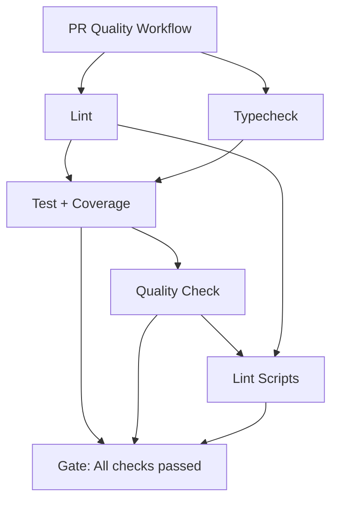

# CI/CD Documentation (ADHD-friendly)

> **Cross-reference**: See [RELEASES.md](./RELEASES.md) for release automation workflows.
> **Visual learner?** See [RELEASES.mmd](./RELEASES.mmd) for a flowchart of release paths.

Quick rules:
- 20 automated workflows handle everything from linting to releases
- Pre-commit hooks for fast feedback, CI for comprehensive validation
- Single gate job (`All checks passed`) is the only required status check
- Branch protection configured for safe collaboration without blocking automation

---

## Table of Contents

- [Quick Reference](#quick-reference)
- [CI/CD Philosophy](#cicd-philosophy)
- [Workflow Inventory](#workflow-inventory)
- [Core Quality Workflows](#core-quality-workflows)
- [Release Workflows](#release-workflows)
- [Security Workflows](#security-workflows)
- [Automation & Maintenance](#automation--maintenance)
- [Branch Protection Strategy](#branch-protection-strategy)
- [Common Patterns](#common-patterns)
- [Troubleshooting](#troubleshooting)
- [Best Practices](#best-practices)

---

## Quick Reference

| Need | Command/Workflow |
|------|------------------|
| Run all quality checks locally | `bun run validate` |
| Lint code | `bun run lint` |
| Fix lint issues | `bun run lint:fix` |
| Type check | `bun run typecheck` |
| Run tests | `bun run test` |
| Run tests (CI mode) | `bun run test:ci` |
| Check package hygiene | `bun run hygiene` |
| Quality check (CI) | `bun run quality-check:ci` |
| Trigger PR checks | Push to PR branch |
| Create release | See [RELEASES.md](./RELEASES.md) |

---

## CI/CD Philosophy

This project uses a **defense-in-depth** approach with three layers:

### Layer 1: Pre-Commit Hooks (Fast Feedback)
- **Speed**: Milliseconds to ~1 second max
- **What**: Formatting, simple linting, commit message validation
- **Why**: Catch issues before they hit CI
- **Tools**: Husky (disabled in CI with `HUSKY=0`)

### Layer 2: CI Checks (Comprehensive Validation)
- **Speed**: 2-10 minutes
- **What**: All checks (lint, typecheck, tests, builds)
- **Why**: Uniform enforcement—cannot be bypassed
- **Tools**: GitHub Actions + Bun

### Layer 3: Branch Protection (Enforcement)
- **Required**: Single gate job (`All checks passed`)
- **Why**: Ensures quality without blocking automation
- **Reference**: [Branch Protection Strategy](#branch-protection-strategy)

**Key principle**: "Everything that takes milliseconds runs in pre-commit; everything else runs in CI."

Source: [Pre-commit vs. CI Best Practices](https://switowski.com/blog/pre-commit-vs-ci/)

---

## Workflow Inventory

**Total**: 20 automated workflows

### Core Quality Workflows (Run on PRs)

| Workflow | Trigger | Purpose | Required Check |
|----------|---------|---------|----------------|
| **PR quality** | PR + main push | Lint, typecheck, test, quality gate | ✅ `All checks passed` |
| **Commitlint** | PR + main push | Validate commit messages | ❌ (runs but not required) |
| **PR Title Lint** | PR | Validate PR title format | ❌ |
| **Workflow Lint** | PR | Validate GitHub Actions syntax | ❌ |
| **Node.js Compatibility** | PR | Test across Node versions | ❌ |

### Release Workflows (Publishing)

| Workflow | Trigger | Purpose | Details |
|----------|---------|---------|---------|
| **Changesets Manage & Publish** | main push | Auto Version Packages PR + publish | [RELEASES.md](./RELEASES.md#1-auto-publish-on-main) |
| **Channel Release** | Manual | Prerelease/canary publishing | [RELEASES.md](./RELEASES.md#2-manual-channel-release) |
| **Release** | Manual | Stable release with quality checks | [RELEASES.md](./RELEASES.md#3-manual-stable-release) |
| **Alpha Snapshot** | Daily (schedule) | Automated alpha builds | [RELEASES.md](./RELEASES.md) |
| **Version Packages Auto-Merge** | PR from bot | Enable auto-merge on Version Packages | [Troubleshooting](./RELEASES.md#troubleshooting) |
| **Pre-Mode Toggle** | Manual | Enter/exit prerelease mode | [RELEASES.md](./RELEASES.md) |

### Security Workflows

| Workflow | Trigger | Purpose |
|----------|---------|---------|
| **Security Scans** | Daily (schedule) | OSV vulnerability scanning |
| **Dependency Review** | PR | Block PRs with vulnerable deps |
| **CodeQL** | PR + main push | Static analysis security scanning |

### Automation & Maintenance

| Workflow | Trigger | Purpose |
|----------|---------|---------|
| **Auto-generate Changeset** | PR | Create changeset if missing |
| **Dependabot Auto-Merge** | Dependabot PR | Auto-approve/merge dependency updates |
| **Deploy Documentation** | main push | Deploy docs site |
| **Tag Assets** | Tag push | Generate SBOM + GitHub release |
| **Package Hygiene** | Manual | Validate package.json + types |
| **Emergency Rollback** | Manual | Revert failed releases |

---

## Core Quality Workflows

### PR Quality Workflow (pr-quality.yml)

**The foundation of your CI/CD pipeline.**

**Triggers**:
- Pull requests (opened, synchronize, reopened, ready_for_review)
- Push to `main`
- Manual (`workflow_dispatch`)

**Jobs** (run in parallel where possible):



#### Job 1: Lint
- **Runtime**: ~30 seconds
- **Command**: `bun run lint` (Biome)
- **Checks**: Code style, unused vars, complexity

#### Job 2: Typecheck
- **Runtime**: ~45 seconds
- **Command**: `bun run typecheck` (tsc --noEmit)
- **Checks**: TypeScript type errors

#### Job 3: Test + Coverage
- **Runtime**: ~2-5 minutes
- **Depends on**: lint, typecheck
- **Command**: `bun run test:ci`
- **Outputs**:
  - JUnit XML test results
  - Coverage reports (HTML + lcov)
  - Coverage metrics for gate
- **Annotations**: Test failures via dorny/test-reporter
- **PR Comment**: Coverage summary with thresholds (80% lines/branches/functions)

#### Job 4: Quality Check
- **Runtime**: ~1 minute
- **Depends on**: test
- **Command**: `bun run quality-check:ci`
- **Checks**: Biome format + typecheck (delta since main)

#### Job 5: Lint Scripts
- **Runtime**: ~10 seconds
- **Command**: `shellcheck .github/scripts/*.sh`
- **Checks**: Shell script linting

#### Job 6: Gate (All checks passed)
- **Purpose**: Single aggregation point for branch protection
- **Depends on**: lint, typecheck, test, quality, lint-scripts
- **Outputs**: Summary table of all check results + coverage metrics

**Why a gate job?**
- [Monorepo best practice](https://mergify.com/blog/monorepo-ci-for-github-actions-run-exactly-the-tests-you-need-nothing-more): "A Single Gate for Branch Protection"
- Prevents "waiting for status" issues with bot PRs
- Required by branch protection (only this job, not individual checks)

**Optimizations**:
- Concurrency: Cancel in-flight runs for same branch
- Caching: Bun dependencies cached via `.github/actions/setup-bun`
- Parallel execution: lint + typecheck run simultaneously

---

### Commitlint Workflow (commitlint.yml)

**Validates commit messages follow Conventional Commits.**

**Triggers**:
- Pull requests (opened, synchronize, edited, reopened)
- Push to `main`

**Skips**:
- Dependabot PRs
- GitHub Actions bot PRs
- Renovate bot PRs

**Command**: `wagoid/commitlint-github-action` with `commitlint.config.mjs`

**Format**: `<type>(<scope>): <subject>`

**Valid types**: feat, fix, docs, style, refactor, perf, test, build, ci, chore, revert

**Why not required in branch protection?**
- Already enforced by pre-commit hook locally
- Covered by gate job pattern
- [Research finding](https://medium.com/@cyberengage.org/part-2-git-commit-hooks-pre-commit-checks-branch-protections-security-in-action-a4fa9eb15922): "Pre-commit for fast checks, CI for comprehensive validation"

---

### Node.js Compatibility Workflow (node-compat.yml)

**Tests package across multiple Node.js versions.**

**Triggers**: Pull requests

**Matrix**:
- Node 18.x (LTS)
- Node 20.x (LTS)
- Node 22.x (Current)

**Steps**:
1. Install dependencies with Bun
2. Build package
3. Run tests with Node.js runtime

**Why test with Node?**
- Package may be consumed by Node.js users
- Ensures compatibility beyond Bun runtime

---

## Release Workflows

See [RELEASES.md](./RELEASES.md) for complete release workflow documentation.

**Quick summary**:

### Changesets Manage & Publish (changesets-manage-publish.yml)
- **Auto-creates "Version Packages" PR** when changesets exist
- **Auto-publishes to npm** when Version Packages PR is merged
- **Uses OIDC trusted publishing** (no NPM_TOKEN needed)
- **Limitation**: Bot PRs don't trigger required checks ([see Troubleshooting](#bot-prs-stuck))

### Channel Release (channel-release.yml)
- **Manual workflow** for prerelease channels (next/beta/rc/canary)
- **Three modes**: version, publish, snapshot
- **OIDC support** for secure publishing

### Release (release.yml)
- **Manual stable releases** with full quality checks
- **Generates SBOM** (Software Bill of Materials)
- **Creates GitHub releases** automatically

**Cross-reference**: [RELEASES.md](./RELEASES.md) for step-by-step release guides.

---

## Security Workflows

### Security Scans (security.yml)

**Daily vulnerability scanning with OSV.**

**Trigger**: Daily at 02:00 UTC

**Command**: `osv-scanner --lockfile=bun.lock`

**Purpose**: Detect known vulnerabilities in dependencies

### Dependency Review (dependency-review.yml)

**Blocks PRs with vulnerable or restricted dependencies.**

**Trigger**: Pull requests

**Checks**:
- Known security vulnerabilities
- License compliance
- Dependency changes

**Action**: `actions/dependency-review-action`

### CodeQL (codeql.yml)

**Static analysis security scanning.**

**Triggers**:
- Push to `main`
- Pull requests to `main`
- Weekly schedule (Monday 05:00 UTC)

**Language**: JavaScript/TypeScript

**Queries**: security-and-quality

**Purpose**: Find security vulnerabilities in code

---

## Automation & Maintenance

### Auto-generate Changeset (autogenerate-changeset.yml)

**Creates changeset if PR doesn't have one.**

**Trigger**: Pull requests

**Logic**:
1. Check if changeset exists
2. If not, generate with type=patch and summary from PR title
3. Commit to PR branch

**Why?**
- Ensures every PR has a changeset for version tracking
- Prevents "forgot to add changeset" errors

### Dependabot Auto-Merge (dependabot-auto-merge.yml)

**Auto-approves and merges Dependabot PRs.**

**Trigger**: `pull_request_target` from Dependabot

**Conditions**:
- PR author is `dependabot[bot]`
- All checks pass

**Actions**:
1. Auto-approve PR
2. Enable auto-merge (squash)

**Security**: Uses `pull_request_target` for write permissions

### Deploy Documentation (deploy-docs.yml)

**Deploys docs site to GitHub Pages.**

**Trigger**: Push to `main`

**Steps**:
1. Build docs: `cd website && bun run build`
2. Deploy to gh-pages branch

**URL**: Configured in repo settings

### Version Packages Auto-Merge (version-packages-auto-merge.yml)

**Enables auto-merge on "Version Packages" PR.**

**Trigger**: `pull_request_target`

**Conditions**:
- PR title is "Version Packages"
- PR author contains "github-actions"

**Action**: Enable auto-merge with squash method

**Known issue**: Required status checks block merge ([see Troubleshooting](#bot-prs-stuck))

---

## Branch Protection Strategy

**Current configuration** (from research + audit):

### Required Settings

✅ **Require pull request reviews**
- Minimum approvals: 0 (allows automation)
- Dismiss stale reviews: Yes
- Require code owner review: No

✅ **Require status checks to pass**
- Required check: **"All checks passed"** (gate job only)
- Require branches to be up to date: Yes (strict mode)

✅ **Enforce for administrators**: Yes

❌ **Do NOT require individual checks** (commitlint, lint, typecheck)
- **Why**: Creates "waiting for status" issues with bot PRs
- **Research**: [GitHub docs](https://docs.github.com/repositories/configuring-branches-and-merges-in-your-repository/managing-protected-branches/about-protected-branches) warn against duplicate job names

### The Bot PR Problem

**Problem**: When `GITHUB_TOKEN` creates a PR (like "Version Packages"), workflows don't trigger.

**Impact**:
- Required status checks never run
- PR appears stuck "waiting for status to be reported"
- Auto-merge can't proceed

**Why**: [GitHub security feature](https://github.com/changesets/action/issues/187) prevents recursive workflow runs

**Solutions**:

1. **Use only gate job** (current approach) ✅
   - Gate job doesn't need to run on bot PRs
   - Bot PRs are auto-generated, don't need validation

2. **GitHub App Token** (long-term solution)
   - Use `tibdex/github-app-token` instead of `GITHUB_TOKEN`
   - Triggers all workflows normally
   - [Reference](https://github.com/marketplace/actions/github-app-token)

3. **Ruleset Exemptions** (alternative)
   - Exempt `github-actions[bot]` from required checks
   - [New GitHub feature](https://github.blog/changelog/2025-09-10-github-ruleset-exemptions-and-repository-insights-updates/)

**Cross-reference**: [RELEASES.md Troubleshooting](./RELEASES.md#troubleshooting) for detailed solutions

---

## Common Patterns

### Composite Actions

**Reusable actions for consistency across workflows.**

#### standard-ci-env
**Location**: `.github/actions/standard-ci-env/action.yml`

**Purpose**: Export standard environment variables

**Variables**:
- `TZ=UTC` - Consistent timezone
- `TF_BUILD=true` - Suppress interactive prompts

**Usage**:
```yaml
- uses: ./.github/actions/standard-ci-env
```

#### setup-bun
**Location**: `.github/actions/setup-bun/action.yml`

**Purpose**: Setup Bun with global cache

**Features**:
- Reads version from `.bun-version` file
- Caches Bun dependencies globally
- Optional registry URL for authenticated npm ops

**Cache key**: `bun-${{ runner.os }}-${{ hashFiles('bun.lock') }}`

**Usage**:
```yaml
- uses: ./.github/actions/setup-bun
  with:
    registry-url: 'https://registry.npmjs.org/'
```

### Concurrency Control

**Pattern**: Cancel in-flight runs for same branch/PR

```yaml
concurrency:
  group: ${{ github.workflow }}-${{ github.head_ref || github.ref }}
  cancel-in-progress: true
```

**Why**: Saves CI minutes when pushing multiple commits rapidly

**Used in**:
- pr-quality.yml
- commitlint.yml
- All PR-triggered workflows

### Security: Harden Runner

**Pattern**: Audit egress traffic from workflows

```yaml
- uses: step-security/harden-runner@v2.11.1
  with:
    egress-policy: audit
```

**Why**: Detect malicious or unexpected network calls

**Used in**: Security-sensitive workflows (release, publish)

### Permissions: Least Privilege

**Pattern**: Explicit permissions per workflow

```yaml
permissions:
  contents: read      # Read repo
  actions: read       # Read workflow runs
  checks: write       # Report check results
  pull-requests: write # Comment on PRs
```

**Default**: No permissions unless specified

**Why**: Security best practice - [GitHub docs](https://docs.github.com/en/actions/security-guides/automatic-token-authentication#permissions-for-the-github_token)

---

## Troubleshooting

### Bot PRs Stuck (No Status Checks)

**Symptom**: "Version Packages" or other bot PRs show "Waiting for status to be reported"

**Cause**: `GITHUB_TOKEN` doesn't trigger workflows ([GitHub limitation](https://github.com/changesets/action/issues/187))

**Solutions**:
1. **Manually merge**: `gh pr review 51 --approve && gh pr merge 51 --squash`
2. **Update branch protection**: Remove individual required checks, keep only gate job
3. **Use GitHub App token**: Update `changesets-manage-publish.yml` ([guide](https://github.com/marketplace/actions/github-app-token))

**Cross-reference**: [RELEASES.md Troubleshooting](./RELEASES.md#troubleshooting)

### Workflow Not Triggering

**Symptoms**:
- PR created but no checks run
- Push to branch but workflows don't start

**Common causes**:

1. **Workflow file syntax error**
   - Run: `bun run lint:workflows` (actionlint)
   - Check: `.github/workflows/workflow-lint.yml` logs

2. **Bot created the PR**
   - See [Bot PRs Stuck](#bot-prs-stuck)

3. **Path filters exclude changes**
   - Check `paths` or `paths-ignore` in workflow trigger

4. **Concurrency cancelled it**
   - Newer run for same branch cancelled this one
   - Normal behavior, not an error

### Tests Failing Locally But Pass in CI

**Symptom**: `bun test` passes locally, `bun run test:ci` fails

**Cause**: Environment differences

**Differences**:
- `TF_BUILD=true` in CI (suppress interactive prompts)
- `TZ=UTC` in CI (consistent timezone)
- Fresh `bun install --frozen-lockfile` in CI

**Debug**:
```bash
# Simulate CI environment locally
TF_BUILD=true TZ=UTC bun test --recursive
```

### CI Taking Too Long

**Symptoms**: Workflows timeout or take >10 minutes

**Common causes**:

1. **Bun cache miss**
   - Check: Cache hit logs in "Cache Bun dependencies" step
   - Fix: Ensure `bun.lock` hasn't changed unexpectedly

2. **Parallel jobs not running**
   - Check: `needs:` dependencies in workflow
   - Fix: Remove unnecessary dependencies

3. **Test suite slow**
   - Profile: `bun test --coverage` (see slow tests)
   - Optimize: Slow tests or mock external services

**Best practices**:
- Keep tests under 5 minutes total
- Use `timeout-minutes` on jobs (default: 360 minutes!)
- [Monorepo CI research](https://medium.com/@wafoaristide/ci-cd-for-monorepos-traps-and-best-practices-be91aae7accb): "If pipeline takes 45 minutes for 3 lines, rethink approach"

### Coverage Requirements Failing

**Symptom**: PR blocked because coverage below threshold (80%)

**Coverage thresholds** (in pr-quality.yml):
- Lines: 80%
- Branches: 80%
- Functions: 80%

**Solutions**:

1. **Add tests for new code**
   - Run: `bun run test:coverage`
   - Check: `test-results/coverage/index.html`

2. **Exclude test utilities**
   - Update: Coverage config in test files
   - Pattern: Don't test test helpers

3. **Lower threshold** (not recommended)
   - Edit: `pr-quality.yml` line 124-126
   - Discuss: With team first

---

## Best Practices

### Local Development

**Run before pushing**:
```bash
# Full validation suite (what CI runs)
bun run validate

# Or step by step:
bun run lint           # Fast (~30s)
bun run typecheck      # Fast (~45s)
bun run test           # Slower (~2-5min)
```

**Fix issues automatically**:
```bash
bun run lint:fix       # Auto-fix lint errors
```

**Watch mode for development**:
```bash
bun run test:watch     # Re-run tests on change
bun run watch:types    # Re-run typecheck on change
```

### Writing Workflows

**Follow patterns from existing workflows**:

1. **Use composite actions**
   - `standard-ci-env` for environment
   - `setup-bun` for runtime + cache

2. **Add concurrency control**
   ```yaml
   concurrency:
     group: ${{ github.workflow }}-${{ github.head_ref || github.ref }}
     cancel-in-progress: true
   ```

3. **Set explicit permissions**
   ```yaml
   permissions:
     contents: read
     # Only add what you need
   ```

4. **Add timeout**
   ```yaml
   jobs:
     my-job:
       timeout-minutes: 10  # Fail fast
   ```

5. **Use harden-runner for security**
   ```yaml
   - uses: step-security/harden-runner@v2.11.1
     with:
       egress-policy: audit
   ```

### Commit Messages

**Format**: `<type>(<scope>): <subject>`

**Examples**:
```
feat(auth): add OAuth2 support
fix(api): handle null user response
docs(ci): document workflow triggers
test(utils): add edge case coverage
```

**Why**: Enables automated changelog + versioning

**Reference**: [Conventional Commits](https://www.conventionalcommits.org/)

### PR Workflow

**Standard flow**:
1. Create feature branch from `main`
2. Make changes + commit (pre-commit hooks run)
3. Push branch (triggers PR quality workflow)
4. Create PR (triggers auto-generate changeset if missing)
5. Review automated checks
6. Address any failures
7. Get approval (if needed)
8. Merge (squash recommended)

**After merge to main**:
- Changesets Manage & Publish creates "Version Packages" PR
- Review version bumps
- Merge "Version Packages" PR
- Package auto-publishes to npm

**Reference**: [RELEASES.md](./RELEASES.md) for release flow details

### Adding New Checks

**When to add to branch protection**:
- ❌ Never add individual job checks
- ✅ Only require the gate job (`All checks passed`)

**When to add a new workflow**:
1. Create workflow in `.github/workflows/`
2. Test with manual trigger (`workflow_dispatch`)
3. Add to documentation (this file!)
4. If quality check: Add as job dependency to gate in `pr-quality.yml`

**Pattern**: All quality jobs → gate job → branch protection

**Why**: [Monorepo best practice](https://engineering.mixpanel.com/enforcing-required-checks-on-conditional-ci-jobs-in-a-github-monorepo-8d4949694340) - single aggregation point

---

## Research Sources

This documentation is based on industry best practices and research:

### Branch Protection
- [GitHub Protected Branches Docs](https://docs.github.com/repositories/configuring-branches-and-merges-in-your-repository/managing-protected-branches/about-protected-branches)
- [Branch Protection Best Practices - Medium](https://medium.com/@cyberengage.org/part-2-git-commit-hooks-pre-commit-checks-branch-protections-security-in-action-a4fa9eb15922)
- [GitHub Ruleset Exemptions](https://github.blog/changelog/2025-09-10-github-ruleset-exemptions-and-repository-insights-updates/)

### CI/CD Philosophy
- [Pre-commit vs. CI](https://switowski.com/blog/pre-commit-vs-ci/)
- [CI/CD for Monorepos: Traps and Best Practices](https://medium.com/@wafoaristide/ci-cd-for-monorepos-traps-and-best-practices-be91aae7accb)
- [Monorepo CI Best Practices - Buildkite](https://buildkite.com/resources/blog/monorepo-ci-best-practices/)

### Bot PR Issues
- [Changesets Action Issue #187](https://github.com/changesets/action/issues/187)
- [GitHub Actions Not Run on Bot PRs](https://github.com/orgs/community/discussions/25602)
- [GitHub App Token Action](https://github.com/marketplace/actions/github-app-token)

### Monorepo Patterns
- [Enforcing Required Checks in Monorepos - Mixpanel](https://engineering.mixpanel.com/enforcing-required-checks-on-conditional-ci-jobs-in-a-github-monorepo-8d4949694340)
- [Mergify Monorepo CI](https://mergify.com/blog/monorepo-ci-for-github-actions-run-exactly-the-tests-you-need-nothing-more)
- [Managing Permissions in Monorepos - Graphite](https://graphite.com/guides/managing-permissions-access-control-monorepo)

---

## Appendix: Complete Workflow List

| Workflow | File | Trigger | Purpose |
|----------|------|---------|---------|
| PR quality | pr-quality.yml | PR + main | Quality gate (lint/test/typecheck) |
| Commitlint | commitlint.yml | PR + main | Commit message validation |
| PR Title Lint | pr-title.yml | PR | PR title format check |
| Workflow Lint | workflow-lint.yml | PR | GitHub Actions syntax check |
| Node.js Compatibility | node-compat.yml | PR | Multi-version Node testing |
| Changesets Manage & Publish | changesets-manage-publish.yml | main push | Auto version + publish |
| Channel Release | channel-release.yml | Manual | Prerelease publishing |
| Release | release.yml | Manual | Stable release |
| Alpha Snapshot | alpha-snapshot.yml | Daily | Automated alpha builds |
| Version Packages Auto-Merge | version-packages-auto-merge.yml | Bot PR | Enable auto-merge |
| Pre-Mode Toggle | pre-mode.yml | Manual | Enter/exit pre-mode |
| Security Scans | security.yml | Daily | OSV vulnerability scan |
| Dependency Review | dependency-review.yml | PR | Block vulnerable deps |
| CodeQL | codeql.yml | PR + main + weekly | Static security analysis |
| Auto-generate Changeset | autogenerate-changeset.yml | PR | Create missing changeset |
| Dependabot Auto-Merge | dependabot-auto-merge.yml | Dependabot PR | Auto-merge deps |
| Deploy Documentation | deploy-docs.yml | main push | Deploy docs site |
| Tag Assets | tag-assets.yml | Tag push | SBOM + GitHub release |
| Package Hygiene | package-hygiene.yml | Manual | Validate package setup |
| Emergency Rollback | emergency-rollback.yml | Manual | Revert releases |

---

**Last updated**: 2025-12-03
**Maintained by**: Development team
**Questions?** Open an issue or see [RELEASES.md](./RELEASES.md) for release-specific docs
