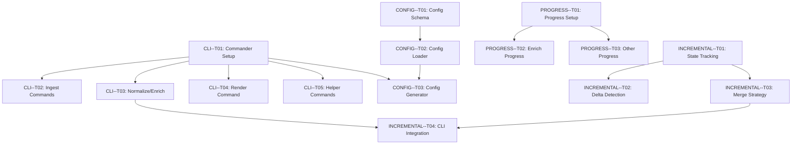

# iMessage Pipeline Enhancements Specification

**Version**: 1.0 **Created**: 2025-10-19 **Status**: Proposed **Epic**:
E7-Production-Ready

---

## Overview

This specification covers 4 major enhancements to make the iMessage pipeline
production-ready:

1. **CLI Interface** - Full commander.js integration with proper argument
   parsing
2. **Configuration File** - YAML/JSON config support with validation
3. **Progress Indicators** - Terminal progress bars for long-running operations
4. **Incremental Mode** - Delta enrichment (only new messages since last run)

**Dependencies**: All E1-E6 epics complete (30/30 tasks)

---

## 1. CLI Interface Enhancement

### 1.1 Overview

**Current State**: Minimal CLI stub at `src/cli.ts` **Goal**: Full-featured CLI
with commander.js, subcommands, and proper error handling

### 1.2 Task Breakdown

#### CLI--T01: Setup Commander.js Structure

**Risk**: LOW | **Estimated**: 1 day

**Description**: Implement main CLI entry point with commander.js framework.

**Acceptance Criteria**:

- **CLI-T01-AC01**: Install commander.js and @types/commander
- **CLI-T01-AC02**: Create main program with version, description, and global
  options
- **CLI-T01-AC03**: Global options: `--verbose`, `--quiet`, `--config <path>`
- **CLI-T01-AC04**: Proper exit codes: 0 (success), 1 (validation error), 2
  (runtime error)
- **CLI-T01-AC05**: Top-level error handler with user-friendly messages

**Example Usage**:

```bash
chatline --version
# 1.0.0

chatline --help
# Usage: chatline [options] [command]
#
# Extract, transform, and analyze iMessage conversations
#
# Options:
#   -V, --version          output the version number
#   -c, --config <path>    config file path (default: imessage-config.json)
#   -v, --verbose          verbose logging
#   -q, --quiet            suppress non-error output
#   -h, --help             display help for command
```

---

#### CLI--T02: Implement Ingest Commands

**Risk**: MEDIUM | **Estimated**: 2 days

**Description**: Create `ingest-csv` and `ingest-db` subcommands.

**Acceptance Criteria**:

- **CLI-T02-AC01**: `ingest-csv` command with all options from usage guide
- **CLI-T02-AC02**: `ingest-db` command with database path and contact filtering
- **CLI-T02-AC03**: Attachment root validation (check directories exist)
- **CLI-T02-AC04**: Input file validation with clear error messages
- **CLI-T02-AC05**: Progress output: "✓ Parsed 2,847 messages from CSV"

**Command Structure**:

```bash
chatline ingest-csv \
  --input <path> \
  --output <path> \
  --attachment-roots <path1> <path2> \
  [--verbose]

chatline ingest-db \
  --db-path <path> \
  --output <path> \
  --contact <identifier> \
  --date-range <start:end> \
  --attachment-roots <path1> <path2> \
  [--verbose]
```

**Validation**:

- Input file exists and is readable
- Attachment roots are directories
- Date range format: `YYYY-MM-DD:YYYY-MM-DD`
- Output directory is writable

---

#### CLI--T03: Implement Normalize and Enrich Commands

**Risk**: HIGH | **Estimated**: 3 days

**Description**: Create `normalize-link` and `enrich-ai` subcommands with full
option support.

**Acceptance Criteria**:

- **CLI-T03-AC01**: `normalize-link` with merge mode support
- **CLI-T03-AC02**: `enrich-ai` with checkpoint/resume options
- **CLI-T03-AC03**: Rate limiting options: `--rate-limit <ms>`,
  `--max-retries <n>`
- **CLI-T03-AC04**: Enrichment toggles: `--enable-vision`, `--enable-audio`,
  `--enable-links`
- **CLI-T03-AC05**: Resume flag: `--resume` loads last checkpoint automatically

**Command Structure**:

```bash
chatline normalize-link \
  --input <path> \
  --output <path> \
  [--merge-csv-db] \
  [--csv-input <path>] \
  [--db-input <path>] \
  [--verbose]

chatline enrich-ai \
  --input <path> \
  --output <path> \
  [--checkpoint-interval <n>] \
  [--resume] \
  [--force-refresh] \
  [--rate-limit <ms>] \
  [--max-retries <n>] \
  [--gemini-api-key <key>] \
  [--enable-vision] \
  [--enable-audio] \
  [--enable-links] \
  [--image-cache-dir <path>]
```

**Resume Logic**:

```typescript
// If --resume flag provided:
// 1. Check for checkpoint in ./checkpoints/enrich-checkpoint-latest.json
// 2. Verify config hash matches current config
// 3. Resume from lastProcessedIndex + 1
// 4. If no checkpoint found, start from beginning
```

---

#### CLI--T04: Implement Render Command

**Risk**: LOW | **Estimated**: 1 day

**Description**: Create `render-markdown` subcommand.

**Acceptance Criteria**:

- **CLI-T04-AC01**: `render-markdown` with date filtering options
- **CLI-T04-AC02**: Grouping toggles: `--group-by-time`, `--nested-replies`
- **CLI-T04-AC03**: Max nesting depth: `--max-nesting-depth <n>` (default 10)
- **CLI-T04-AC04**: Output directory creation if doesn't exist
- **CLI-T04-AC05**: Summary output: "✓ Wrote 92 markdown files to ./timeline/"

**Command Structure**:

```bash
chatline render-markdown \
  --input <path> \
  --output-dir <path> \
  [--date-range <start:end>] \
  [--group-by-time] \
  [--nested-replies] \
  [--max-nesting-depth <n>]
```

---

#### CLI--T05: Add Helper Commands

**Risk**: LOW | **Estimated**: 1 day

**Description**: Utility commands for validation, stats, and cleanup.

**Acceptance Criteria**:

- **CLI-T05-AC01**: `validate` command to check JSON against schema
- **CLI-T05-AC02**: `stats` command to show message counts by type
- **CLI-T05-AC03**: `clean` command to remove checkpoints and temp files
- **CLI-T05-AC04**: `doctor` command to diagnose common issues
- **CLI-T05-AC05**: Each helper has `--help` with examples

**Command Structure**:

```bash
# Validate JSON structure
chatline validate <file>

# Show statistics
chatline stats <file>
# Output:
# Total messages: 3,098
# By kind: text (2,275), media (823), tapback (234), notification (12)
# Date range: 2024-01-01 to 2024-12-31

# Clean up temporary files
chatline clean [--checkpoints] [--cache] [--all]

# Diagnose issues
chatline doctor
# Checks:
# ✓ Node.js version >= 22.20
# ✓ pnpm installed
# ✓ GEMINI_API_KEY set
# ⚠ FIRECRAWL_API_KEY not set (optional)
# ✓ Attachment roots exist
```

---

### 1.3 Technical Implementation

**File Structure**:

```
src/
├── cli.ts                    # Main entry point
├── cli/
│   ├── commands/
│   │   ├── ingest-csv.ts
│   │   ├── ingest-db.ts
│   │   ├── normalize-link.ts
│   │   ├── enrich-ai.ts
│   │   ├── render-markdown.ts
│   │   ├── validate.ts
│   │   ├── stats.ts
│   │   ├── clean.ts
│   │   └── doctor.ts
│   ├── utils/
│   │   ├── validators.ts     # Input validation
│   │   ├── formatters.ts     # Output formatting
│   │   └── errors.ts         # Error handling
│   └── types.ts              # CLI types
```

**Main CLI Structure**:

```typescript
// src/cli.ts
import { Command } from 'commander'
import { ingestCsvCommand } from './cli/commands/ingest-csv'
import { enrichAiCommand } from './cli/commands/enrich-ai'
// ... other imports

const program = new Command()

program
  .name('@nathanvale/chatline')
  .version('1.0.0')
  .description('Extract, transform, and analyze iMessage conversations')
  .option('-c, --config <path>', 'config file path', 'imessage-config.json')
  .option('-v, --verbose', 'verbose logging', false)
  .option('-q, --quiet', 'suppress non-error output', false)

// Register subcommands
program.addCommand(ingestCsvCommand)
program.addCommand(enrichAiCommand)
// ... other commands

// Global error handler
program.exitOverride((err) => {
  if (err.code === 'commander.help') process.exit(0)
  if (err.code === 'commander.version') process.exit(0)

  console.error(`Error: ${err.message}`)
  process.exit(err.exitCode || 1)
})

await program.parseAsync()
```

**Command Template**:

```typescript
// src/cli/commands/enrich-ai.ts
import { Command } from 'commander'
import { enrichMessages } from '#enrich/index'

export const enrichAiCommand = new Command('enrich-ai')
  .description('Add AI-powered enrichment to messages')
  .requiredOption('--input <path>', 'input JSON file')
  .requiredOption('--output <path>', 'output JSON file')
  .option('--checkpoint-interval <n>', 'checkpoint interval', '100')
  .option('--resume', 'resume from last checkpoint', false)
  .option('--rate-limit <ms>', 'delay between API calls', '1000')
  .action(async (options) => {
    try {
      // Validate inputs
      await validateInputFile(options.input)

      // Load config
      const config = await loadConfig(options.config)

      // Run enrichment
      const result = await enrichMessages({
        input: options.input,
        output: options.output,
        checkpointInterval: parseInt(options.checkpointInterval),
        resume: options.resume,
        rateLimitDelay: parseInt(options.rateLimit),
        ...config,
      })

      // Output summary
      console.log(`✓ Enriched ${result.processedCount} messages`)
      console.log(`✓ Wrote ${options.output}`)
    } catch (error) {
      console.error(`Error: ${error.message}`)
      process.exit(1)
    }
  })
```

---

## 2. Configuration File Support

### 2.1 Overview

**Goal**: Load settings from YAML/JSON config files with schema validation

### 2.2 Task Breakdown

#### CONFIG--T01: Define Config Schema

**Risk**: LOW | **Estimated**: 1 day

**Description**: Create Zod schema for configuration with validation.

**Acceptance Criteria**:

- **CONFIG-T01-AC01**: Config schema with Zod validation
- **CONFIG-T01-AC02**: Support JSON and YAML formats
- **CONFIG-T01-AC03**: Environment variable interpolation: `${ENV_VAR}`
- **CONFIG-T01-AC04**: Config file discovery:
  `./imessage-config.{json,yaml,yml}`
- **CONFIG-T01-AC05**: Validation errors show field path and expected type

**Config Structure**:

```yaml
# imessage-config.yaml
version: '1.0'

attachmentRoots:
  - ~/Library/Messages/Attachments
  - /Volumes/Backup/old-attachments

gemini:
  apiKey: ${GEMINI_API_KEY}
  model: gemini-1.5-pro
  rateLimitDelay: 1000
  maxRetries: 3

firecrawl:
  apiKey: ${FIRECRAWL_API_KEY}
  enabled: true

enrichment:
  enableVisionAnalysis: true
  enableAudioTranscription: true
  enableLinkEnrichment: true
  imageCacheDir: ./.cache/images
  checkpointInterval: 100
  forceRefresh: false

render:
  groupByTimeOfDay: true
  renderRepliesAsNested: true
  renderTapbacksAsEmoji: true
  maxNestingDepth: 10
```

**JSON Format**:

```json
{
  "attachmentRoots": ["~/Library/Messages/Attachments"],
  "gemini": {
    "apiKey": "${GEMINI_API_KEY}",
    "model": "gemini-1.5-pro"
  },
  "version": "1.0"
}
```

---

#### CONFIG--T02: Implement Config Loader

**Risk**: MEDIUM | **Estimated**: 2 days

**Description**: Create config loading with precedence and validation.

**Acceptance Criteria**:

- **CONFIG-T02-AC01**: Load config from file with YAML/JSON auto-detection
- **CONFIG-T02-AC02**: Merge with CLI options (CLI > config > defaults)
- **CONFIG-T02-AC03**: Environment variable substitution with `${VAR}` syntax
- **CONFIG-T02-AC04**: Config validation with helpful error messages
- **CONFIG-T02-AC05**: Cache loaded config to avoid repeated file reads

**Precedence Order** (highest to lowest):

1. CLI flags (e.g., `--gemini-api-key`)
2. Environment variables (e.g., `GEMINI_API_KEY`)
3. Config file (e.g., `imessage-config.yaml`)
4. Built-in defaults

**Implementation**:

```typescript
// src/cli/utils/config.ts
import { z } from 'zod'
import { readFile } from 'fs/promises'
import yaml from 'js-yaml'

const ConfigSchema = z.object({
  version: z.string().default('1.0'),
  attachmentRoots: z
    .array(z.string())
    .default(['~/Library/Messages/Attachments']),
  gemini: z.object({
    apiKey: z.string(),
    model: z.string().default('gemini-1.5-pro'),
    rateLimitDelay: z.number().default(1000),
    maxRetries: z.number().default(3),
  }),
  firecrawl: z
    .object({
      apiKey: z.string().optional(),
      enabled: z.boolean().default(true),
    })
    .optional(),
  enrichment: z.object({
    enableVisionAnalysis: z.boolean().default(true),
    enableAudioTranscription: z.boolean().default(true),
    enableLinkEnrichment: z.boolean().default(true),
    imageCacheDir: z.string().default('./.cache/images'),
    checkpointInterval: z.number().default(100),
    forceRefresh: z.boolean().default(false),
  }),
  render: z.object({
    groupByTimeOfDay: z.boolean().default(true),
    renderRepliesAsNested: z.boolean().default(true),
    renderTapbacksAsEmoji: z.boolean().default(true),
    maxNestingDepth: z.number().default(10),
  }),
})

export type Config = z.infer<typeof ConfigSchema>

export async function loadConfig(
  configPath?: string,
  cliOptions?: Partial<Config>,
): Promise<Config> {
  // 1. Load config file
  const filePath = configPath || (await discoverConfigFile())
  const fileConfig = filePath ? await loadConfigFile(filePath) : {}

  // 2. Substitute environment variables
  const withEnv = substituteEnvVars(fileConfig)

  // 3. Merge: CLI > file > defaults
  const merged = {
    ...withEnv,
    ...cliOptions,
  }

  // 4. Validate with Zod
  return ConfigSchema.parse(merged)
}

async function discoverConfigFile(): Promise<string | null> {
  const candidates = [
    './imessage-config.yaml',
    './imessage-config.yml',
    './imessage-config.json',
  ]

  for (const path of candidates) {
    if (await fileExists(path)) return path
  }

  return null
}

async function loadConfigFile(path: string): Promise<any> {
  const content = await readFile(path, 'utf-8')

  if (path.endsWith('.json')) {
    return JSON.parse(content)
  } else if (path.endsWith('.yaml') || path.endsWith('.yml')) {
    return yaml.load(content)
  }

  throw new Error(`Unsupported config format: ${path}`)
}

function substituteEnvVars(obj: any): any {
  if (typeof obj === 'string') {
    return obj.replace(/\$\{(\w+)\}/g, (_, envVar) => {
      return process.env[envVar] || ''
    })
  }

  if (Array.isArray(obj)) {
    return obj.map(substituteEnvVars)
  }

  if (typeof obj === 'object' && obj !== null) {
    return Object.fromEntries(
      Object.entries(obj).map(([k, v]) => [k, substituteEnvVars(v)]),
    )
  }

  return obj
}
```

---

#### CONFIG--T03: Add Config Generation Command

**Risk**: LOW | **Estimated**: 1 day

**Description**: Generate starter config files with comments.

**Acceptance Criteria**:

- **CONFIG-T03-AC01**: `init` command to generate config file
- **CONFIG-T03-AC02**: Choose format: `--format <json|yaml>` (default yaml)
- **CONFIG-T03-AC03**: Include comments explaining each option
- **CONFIG-T03-AC04**: Detect existing config and prompt before overwrite
- **CONFIG-T03-AC05**: Validate generated config with schema

**Command**:

```bash
chatline init [--format yaml]
# ✓ Created imessage-config.yaml with defaults
# Edit this file to customize your pipeline settings

chatline init --format json
# ✓ Created imessage-config.json
```

**Generated YAML** (with comments):

```yaml
# iMessage Pipeline Configuration
# Version: 1.0

# Attachment search paths (in order of priority)
attachmentRoots:
  - ~/Library/Messages/Attachments
  - /Volumes/Backup/old-attachments

# Gemini API settings (Google AI Studio)
gemini:
  apiKey: ${GEMINI_API_KEY} # Set GEMINI_API_KEY environment variable
  model: gemini-1.5-pro # Model for vision/audio/PDF
  rateLimitDelay: 1000 # Delay between API calls (ms)
  maxRetries: 3 # Retry attempts for 5xx errors

# Firecrawl API settings (optional)
firecrawl:
  apiKey: ${FIRECRAWL_API_KEY}
  enabled: true # Use Firecrawl for link enrichment

# Enrichment settings
enrichment:
  enableVisionAnalysis: true
  enableAudioTranscription: true
  enableLinkEnrichment: true
  imageCacheDir: ./.cache/images
  checkpointInterval: 100 # Write checkpoint every N items
  forceRefresh: false # Re-enrich existing enrichments

# Rendering settings
render:
  groupByTimeOfDay: true # Group by Morning/Afternoon/Evening
  renderRepliesAsNested: true # Nested blockquotes for replies
  renderTapbacksAsEmoji: true # Render tapbacks as emoji reactions
  maxNestingDepth: 10 # Max reply nesting levels
```

---

## 3. Progress Indicators

### 3.1 Overview

**Goal**: Real-time terminal progress bars for long-running operations

### 3.2 Task Breakdown

#### PROGRESS--T01: Install and Configure Progress Library

**Risk**: LOW | **Estimated**: 1 day

**Description**: Integrate cli-progress library for progress bars.

**Acceptance Criteria**:

- **PROGRESS-T01-AC01**: Install cli-progress and @types/cli-progress
- **PROGRESS-T01-AC02**: Create progress utility with consistent styling
- **PROGRESS-T01-AC03**: Support multi-bar for concurrent operations
- **PROGRESS-T01-AC04**: Disable progress bars when `--quiet` flag used
- **PROGRESS-T01-AC05**: Proper cleanup on Ctrl+C (clear progress bars)

**Progress Bar Styles**:

```
Enriching images: [========    ] 75% (407/542) | ETA: 3m 12s
Transcribing audio: [=====       ] 50% (67/134) | ETA: 8m 45s
Fetching links: [==================] 100% (89/89) | Done!
```

---

#### PROGRESS--T02: Add Progress to Enrichment

**Risk**: MEDIUM | **Estimated**: 2 days

**Description**: Add progress indicators to enrich-ai stage.

**Acceptance Criteria**:

- **PROGRESS-T02-AC01**: Overall enrichment progress (total messages)
- **PROGRESS-T02-AC02**: Per-type progress bars (images, audio, PDFs, links)
- **PROGRESS-T02-AC03**: Show current operation: "Analyzing IMG_1234.heic..."
- **PROGRESS-T02-AC04**: Update ETA based on rolling average of last 10
  operations
- **PROGRESS-T02-AC05**: Checkpoint writes show brief pause in progress

**Implementation**:

```typescript
// src/enrich/progress.ts
import cliProgress from 'cli-progress'

export class EnrichmentProgress {
  private multibar: cliProgress.MultiBar
  private bars: Map<string, cliProgress.SingleBar>

  constructor(private quiet: boolean = false) {
    if (quiet) return

    this.multibar = new cliProgress.MultiBar(
      {
        format:
          '{operation} [{bar}] {percentage}% ({value}/{total}) | ETA: {eta_formatted}',
        barCompleteChar: '\u2588',
        barIncompleteChar: '\u2591',
        clearOnComplete: false,
        hideCursor: true,
      },
      cliProgress.Presets.shades_classic,
    )
  }

  createBar(name: string, total: number): cliProgress.SingleBar {
    if (this.quiet) return null

    const bar = this.multibar.create(total, 0, { operation: name })
    this.bars.set(name, bar)
    return bar
  }

  update(name: string, value: number, currentFile?: string): void {
    if (this.quiet) return

    const bar = this.bars.get(name)
    if (bar) {
      bar.update(value, {
        currentFile: currentFile || '',
      })
    }
  }

  stop(): void {
    if (this.quiet) return
    this.multibar.stop()
  }
}

// Usage in enrich-ai
const progress = new EnrichmentProgress(options.quiet)
const imageBar = progress.createBar('Enriching images', imageCount)

for (let i = 0; i < images.length; i++) {
  const img = images[i]
  await enrichImage(img)
  progress.update('Enriching images', i + 1, img.filename)
}

progress.stop()
```

---

#### PROGRESS--T03: Add Progress to Other Stages

**Risk**: LOW | **Estimated**: 1 day

**Description**: Add progress to ingest, normalize, render stages.

**Acceptance Criteria**:

- **PROGRESS-T03-AC01**: Ingest progress: "Parsing CSV rows..."
- **PROGRESS-T03-AC02**: Normalize progress: "Linking replies..."
- **PROGRESS-T03-AC03**: Render progress: "Rendering 2024-10-15.md..."
- **PROGRESS-T03-AC04**: Spinner for indeterminate operations (DB queries)
- **PROGRESS-T03-AC05**: Final summary always shown (even with --quiet)

**Spinner Usage**:

```typescript
import ora from 'ora'

const spinner = ora('Loading messages from database...').start()
const messages = await loadFromDatabase()
spinner.succeed(`Loaded ${messages.length} messages`)
```

---

## 4. Incremental Mode

### 4.1 Overview

**Goal**: Only enrich new messages since last run (delta enrichment)

### 4.2 Task Breakdown

#### INCREMENTAL--T01: Create State Tracking

**Risk**: HIGH | **Estimated**: 3 days

**Description**: Track enrichment state across runs.

**Acceptance Criteria**:

- **INCREMENTAL-T01-AC01**: State file: `.imessage-state.json` with last run
  metadata
- **INCREMENTAL-T01-AC02**: Track: last enriched date, total messages, config
  hash
- **INCREMENTAL-T01-AC03**: Detect new messages by comparing GUIDs
- **INCREMENTAL-T01-AC04**: State file atomic writes (temp + rename)
- **INCREMENTAL-T01-AC05**: `--incremental` flag to enable delta mode

**State File Structure**:

```json
{
  "configHash": "a3b5c8d0e2f4a6b8",
  "enrichedGuids": ["abc-123", "def-456"],
  "enrichedMessages": 823,
  "lastEnrichedDate": "2024-12-31",
  "lastRun": "2025-10-19T22:30:00.000Z",
  "stats": {
    "audioTranscription": 134,
    "imageAnalysis": 542,
    "linkEnrichment": 89
  },
  "totalMessages": 3098,
  "version": "1.0"
}
```

---

#### INCREMENTAL--T02: Implement Delta Detection

**Risk**: MEDIUM | **Estimated**: 2 days

**Description**: Compare current messages with last state to find new ones.

**Acceptance Criteria**:

- **INCREMENTAL-T02-AC01**: Load previous state from `.imessage-state.json`
- **INCREMENTAL-T02-AC02**: Diff normalized messages against `enrichedGuids`
- **INCREMENTAL-T02-AC03**: Return only new GUIDs for enrichment
- **INCREMENTAL-T02-AC04**: Handle state file missing (treat as first run)
- **INCREMENTAL-T02-AC05**: Log delta summary: "Found 142 new messages to
  enrich"

**Implementation**:

```typescript
// src/enrich/incremental.ts
export async function detectNewMessages(
  normalizedMessages: Message[],
  statePath: string = './.imessage-state.json',
): Promise<Message[]> {
  // Load previous state
  const state = await loadState(statePath)

  if (!state) {
    // First run: enrich all messages
    return normalizedMessages
  }

  // Find new GUIDs
  const enrichedSet = new Set(state.enrichedGuids)
  const newMessages = normalizedMessages.filter(
    (msg) => !enrichedSet.has(msg.guid),
  )

  console.log(`Found ${newMessages.length} new messages to enrich`)
  console.log(`Previously enriched: ${state.enrichedMessages}`)

  return newMessages
}

export async function updateState(
  enrichedMessages: Message[],
  statePath: string = './.imessage-state.json',
): Promise<void> {
  const state = (await loadState(statePath)) || createEmptyState()

  // Update enriched GUIDs
  const newGuids = enrichedMessages.map((m) => m.guid)
  state.enrichedGuids = [...new Set([...state.enrichedGuids, ...newGuids])]

  // Update metadata
  state.lastRun = new Date().toISOString()
  state.totalMessages = enrichedMessages.length
  state.enrichedMessages = state.enrichedGuids.length

  // Atomic write
  await saveStateAtomic(statePath, state)
}
```

---

#### INCREMENTAL--T03: Add Merge Strategy

**Risk**: HIGH | **Estimated**: 2 days

**Description**: Merge new enrichments with existing enriched.json.

**Acceptance Criteria**:

- **INCREMENTAL-T03-AC01**: Load existing `enriched.json` if exists
- **INCREMENTAL-T03-AC02**: Merge new enrichments by GUID (new messages +
  updates)
- **INCREMENTAL-T03-AC03**: Preserve existing enrichments (no overwrites unless
  `--force-refresh`)
- **INCREMENTAL-T03-AC04**: Update statistics in state file
- **INCREMENTAL-T03-AC05**: Backup previous enriched.json as
  `enriched.json.backup`

**Merge Logic**:

```typescript
export async function mergeEnrichedMessages(
  existingPath: string,
  newMessages: Message[],
): Promise<Message[]> {
  // Load existing enriched messages
  const existing = await loadEnrichedMessages(existingPath)

  // Create GUID index
  const existingMap = new Map(existing.map((m) => [m.guid, m]))

  // Merge: new messages override existing by GUID
  for (const newMsg of newMessages) {
    existingMap.set(newMsg.guid, newMsg)
  }

  // Return merged array sorted by date
  return Array.from(existingMap.values()).sort((a, b) =>
    a.date.localeCompare(b.date),
  )
}
```

---

#### INCREMENTAL--T04: Add CLI Integration

**Risk**: LOW | **Estimated**: 1 day

**Description**: Integrate incremental mode into CLI commands.

**Acceptance Criteria**:

- **INCREMENTAL-T04-AC01**: `--incremental` flag on `enrich-ai` command
- **INCREMENTAL-T04-AC02**: Auto-detect state file in current directory
- **INCREMENTAL-T04-AC03**: `--state-file <path>` to override state location
- **INCREMENTAL-T04-AC04**: `--reset-state` to clear state and enrich all
- **INCREMENTAL-T04-AC05**: Progress shows: "Enriching 142 new messages (3098
  total)"

**Command Usage**:

```bash
# First run: enrich all messages
chatline enrich-ai \
  --input normalized.json \
  --output enriched.json \
  --incremental

# Creates .imessage-state.json
# ✓ Enriched 823 messages

# Second run: only new messages
chatline enrich-ai \
  --input normalized.json \
  --output enriched.json \
  --incremental

# Found 142 new messages to enrich
# Previously enriched: 823
# ✓ Enriched 142 new messages (965 total)

# Reset state
chatline enrich-ai \
  --input normalized.json \
  --output enriched.json \
  --incremental \
  --reset-state

# Cleared previous state
# ✓ Enriched 965 messages
```

---

## Task Summary

### Epic E7: Production-Ready (18 tasks)

| Task                 | Title                                  | Risk   | Days | Dependencies               |
| -------------------- | -------------------------------------- | ------ | ---- | -------------------------- |
| **CLI--T01**         | Setup Commander.js Structure           | LOW    | 1    | -                          |
| **CLI--T02**         | Implement Ingest Commands              | MEDIUM | 2    | CLI--T01                   |
| **CLI--T03**         | Implement Normalize/Enrich Commands    | HIGH   | 3    | CLI--T01                   |
| **CLI--T04**         | Implement Render Command               | LOW    | 1    | CLI--T01                   |
| **CLI--T05**         | Add Helper Commands                    | LOW    | 1    | CLI--T01                   |
| **CONFIG--T01**      | Define Config Schema                   | LOW    | 1    | -                          |
| **CONFIG--T02**      | Implement Config Loader                | MEDIUM | 2    | CONFIG--T01                |
| **CONFIG--T03**      | Add Config Generation Command          | LOW    | 1    | CONFIG--T02, CLI--T01      |
| **PROGRESS--T01**    | Install and Configure Progress Library | LOW    | 1    | -                          |
| **PROGRESS--T02**    | Add Progress to Enrichment             | MEDIUM | 2    | PROGRESS--T01              |
| **PROGRESS--T03**    | Add Progress to Other Stages           | LOW    | 1    | PROGRESS--T01              |
| **INCREMENTAL--T01** | Create State Tracking                  | HIGH   | 3    | -                          |
| **INCREMENTAL--T02** | Implement Delta Detection              | MEDIUM | 2    | INCREMENTAL--T01           |
| **INCREMENTAL--T03** | Add Merge Strategy                     | HIGH   | 2    | INCREMENTAL--T01           |
| **INCREMENTAL--T04** | Add CLI Integration                    | LOW    | 1    | CLI--T03, INCREMENTAL--T03 |

**Total**: 18 tasks, 24 estimated days

### Risk Breakdown

- **HIGH**: 3 tasks (CLI--T03, INCREMENTAL--T01, INCREMENTAL--T03)
- **MEDIUM**: 4 tasks (CLI--T02, CONFIG--T02, PROGRESS--T02, INCREMENTAL--T02)
- **LOW**: 11 tasks

---

## Dependencies



---

## Testing Strategy

### Unit Tests

- CLI argument parsing
- Config loading and validation
- Environment variable substitution
- State file operations
- Delta detection logic

### Integration Tests

- End-to-end CLI workflows
- Config precedence (CLI > file > defaults)
- Progress bars with mock operations
- Incremental enrichment with state persistence

### Manual Testing

- Progress bars in real terminal
- Ctrl+C handling
- Error messages clarity
- Help text formatting

---

## Documentation Updates

After implementation, update:

1. **Usage Guide** - Add CLI examples, config file reference, incremental mode
2. **Troubleshooting Guide** - Config validation errors, state file corruption
3. **Implementation Summary** - Add E7 epic completion status

---

## Future Enhancements (Beyond E7)

1. **Web UI** - Browser interface for message browsing
2. **Streaming Mode** - Process messages without loading all in memory
3. **Multi-Threading** - Parallel enrichment across CPU cores
4. **Cloud Storage** - S3/GCS support for large attachments
5. **Plugins** - Custom enrichment providers

---

**Document Version**: 1.0 **Status**: Awaiting approval for implementation
**Estimated Total Time**: 24 days (1 developer) **Recommended Approach**:
Implement in order: CLI → Config → Progress → Incremental
